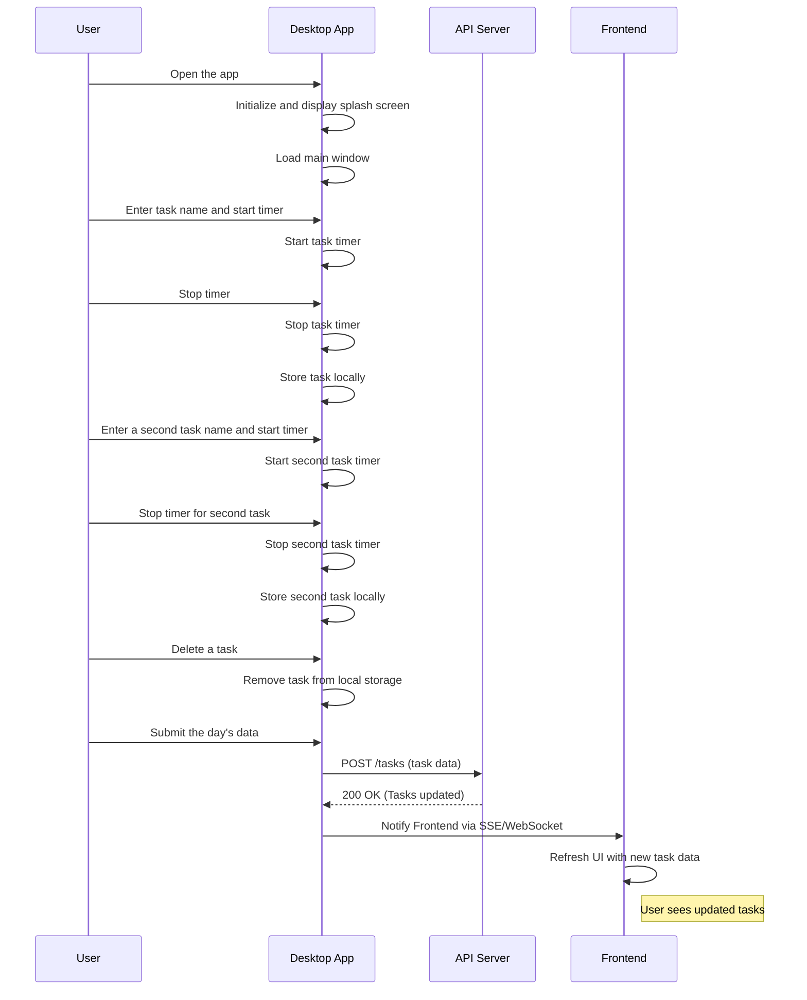

# Welcome to FlexileTT!

  

## Project Overview

  

Flexile Time Tracker is a project exploring a new feature for Flexile.com. As someone who is always looking to improve productivity, I wanted to create a tool I'd use.

This project is very much a work in progress. It's been a great learning experience, and I'm excited to continue developing it further.

  

## Current Features

  

- Basic task tracking (start/stop timer)

- Task list with duration

- Local storage for data persistence

- Simple data submission to a backend server

  

## Tech Stack

  

- Frontend: React

- Backend: Express.js server (very basic at the moment)

- Desktop: Tauri (React frontend with Rust backend)

  

Styled with TailwindCSS. Coded in Cursor. Helped by ClaudeAPI

  
  

## Current State and Next Steps

  

Right now, the app is functional but basic. Of course, it only works locally as Flexile does not have integration features. Yet.

  

Here's what I'd suggest to work on next:

  

1.  **Improve data management**: Implement proper server-side storage, preferably an API. I actually thought to do an API server for this exercise, yet I think this one has more visibility.

2.  **Enhance UI/UX**: Add more interactive elements and improve the overall design.

3.  **Develop Tauri integration**: Create a fully functional desktop app.

4.  **Add data visualization**: Implement charts to provide insights into time usage.

5.  **Implement user authentication**: To allow for personalized experiences.

  

## Installation

  

I am not providing bundles at the moment. So you would have to install Tauri. Fortunately, it's easy to do. Go check [Quick Start | Tauri Apps](https://tauri.app/v1/guides/getting-started/setup/)

  

Then, to run this project locally:

  

1. Clone this repo:

Copy

`git clone git@github.com:rpruizc/flexile-time-tracker.git && cd flexile-time-tracker`

2. Install dependencies:

Copy

`npm install`

3. Start the development server:

Copy

`npm run tauri dev`

  

## Other requirements

  

Please go visit [rpruizc/flexile-api (github.com)](https://github.com/rpruizc/flexile-api) to get the api server and frontend emulation code.